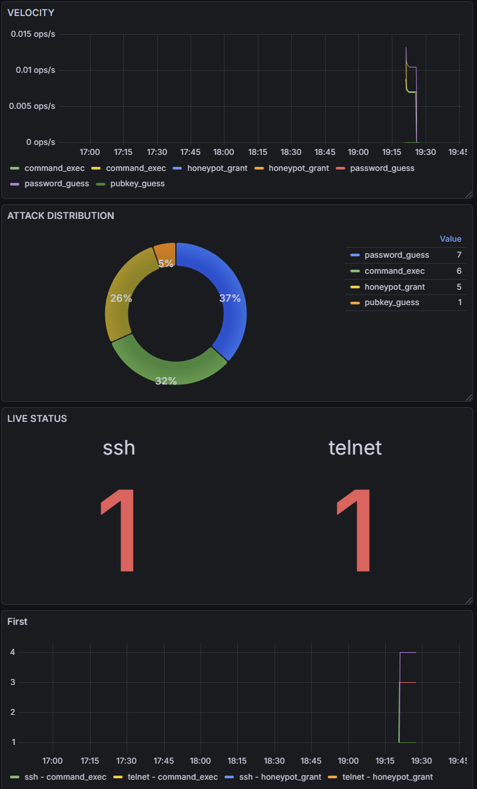

## SSH & TELNET HONEYPOT

This project is a honeypot system designed to simulate SSH and Telnet servers to detect and log unauthorized access attempts, such as password guessing, public key authentication attempts, and command executions. It captures attacker activities, stores them in a SQLite database, and provides daily summaries for analysis. The honeypot grants access after a random number of failed attempts to lure attackers into executing commands in a fake shell environment.

## Technologies Used

- **Python 3.12**: Core language for the application.
- **Prometheus**: Time-series database for collecting honeypot metrics. 
- **Grafana**: Visualization dashboard for real-time monitoring.
- **AsyncIO**: For asynchronous operations and handling concurrent connections.
- **AsyncSSH**: Library for implementing the SSH honeypot server.
- **AIO SQLite**: For database operations.
- **Cryptography**: For secure key generation and handling.
- **Docker**: For containerized deployment.
- **SQLite**: Database for storing logs and daily summaries.

## Monitoring & Visualization

The system includes a built-in monitoring stack that provides:

* **Live Attack Distribution**: Pie chart showing types of attacks (SSH vs Telnet).
* **Attack Velocity**: Real-time rate of events.
* **Active Sessions**: Monitoring current connections to the honeypot.
* **Historical Data**: Analysis of trends over time.



## Setup Instructions
### Prerequisites

* Docker and Docker Compose installed.
* A `.env` file in the root directory with the following content:
```env
GRAFANA_PASSWORD=your_secure_password
```

### Deployment (Docker Compose)

1. **Build and start the services**:
```bash
docker-compose up --build -d
```


This starts:
* **Honeypot**: Ports 22 (SSH) and 23 (Telnet).
* **Prometheus**: Internal metrics collection (port 9090).
* **Grafana**: Dashboard UI (port 3000, bound to localhost for security).


2. **Access the Dashboard (Secure Tunneling)**:
   Since Grafana is bound to `127.0.0.1`, create an SSH tunnel from your local machine to the VM:
```bash
ssh -L 3000:localhost:3000 your_user@your_vm_ip
```


Now, open your browser and go to: `http://localhost:3000`
* **Login**: `admin`
* **Password**: (The value from your `.env` file)


### Automatic Provisioning

The project is configured to automatically set up the monitoring environment:

* **Data Sources**: Prometheus is automatically connected to Grafana.
* **Dashboards**: The "Honeypot Dashboard" is automatically imported from `grafana/dashboards/honeypot.json`.

## Testing and Verification

1. **Simulate an attack**:
```bash
ssh user@your_vm_ip -p 22
```


2. **Verify in Grafana**:
   Observe the "VELOCITY" and "ATTACK DISTRIBUTION" panels. The data should refresh automatically as you interact with the honeypot.
3. **Check logs via terminal**:
```bash
docker exec -it honeypot_app sqlite3 /app/data/honeypot.db "SELECT * FROM logs ORDER BY id DESC LIMIT 5;"
```

### Environment Variables

You can configure the honeypot using environment variables defined in .env or via Docker Compose:

- `HP_SSH_HOST_KEY`: Path to SSH host key (default: ssh_host_key).
- `HP_MAX_CONNS`: Maximum concurrent connections (default: 50).
- `HP_MAX_CMDS`: Maximum commands per session (default: 50).
- `HP_MAX_CMD_LEN`: Maximum command length (default: 256).
- `HP_SESSION_TIMEOUT`: Session idle timeout in seconds (default: 300).
- `HP_BRUTE_MIN/MAX`: Minimum/maximum attempts before granting access (default: 3/7).
- `HP_DB_PATH`: Database file path (default: honeypot.db).
- `GRAFANA_PASSWORD`: Password to grafana.

## Database Location

The SQLite database is stored at honeypot.db (relative to the project root or container's `/app/data`). It contains two main tables:

- `logs`: Stores individual events (e.g., auth attempts, commands).
- `daily_summary`: Aggregates events by day, including totals and classifications.

Use tools like SQLite Browser or command-line `sqlite3` to inspect the database.

## Reading Logs

Logs are stored in two formats:

1. **File-based Logs**: Written to the logs directory. These are text files with timestamps and messages from the application.

2. **Database Logs**: Query the logs table in honeypot.db for structured data. Example query to fetch recent logs:

   ```sql
   SELECT * FROM logs ORDER BY id DESC LIMIT 20;
   ```

   Use the `query_recent_logs` function in db.py for programmatic access.

Daily summaries can be queried from the `daily_summary` table.

## Testing and Verification of Attacks

To test the honeypot and verify attack detection:

1. **Run the Honeypot**: Start the services as described in setup.

2. **Simulate Attacks**:
   - SSH: Use `ssh user@host -p 22` and attempt logins with fake credentials.
   - Telnet: Use `telnet host 23` and attempt logins.

3. **Verify Logs**: 
   Check the database for logged events directly from your terminal. Run this command to see the 10 most recent interactions:

   ```bash
   docker exec -it honeypot_app sqlite3 /app/data/honeypot.db "SELECT timestamp, protocol, event_type, src_ip, raw FROM logs ORDER BY id DESC LIMIT 10
    ```
   This allows you to see real-time data without leaving the host shell.

4. **Check Daily Summaries**: After attacks, inspect the `daily_summary` table for aggregated data.

5. **Monitor Output**: Watch the console or Docker logs for real-time activity.

The honeypot grants access after 3-7 failed attempts (configurable), allowing command execution in a fake shell. All activities are logged for analysis.
